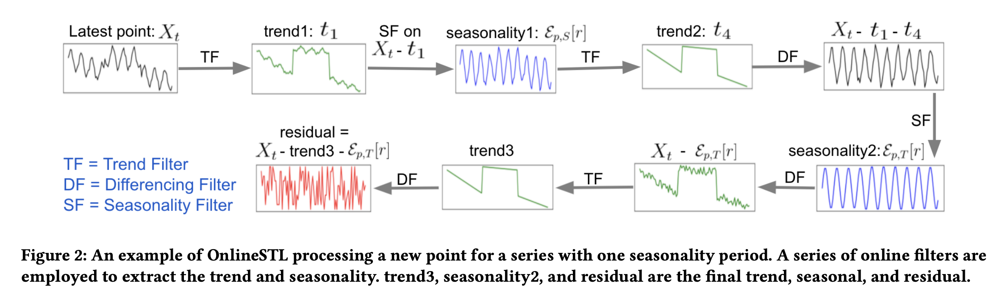
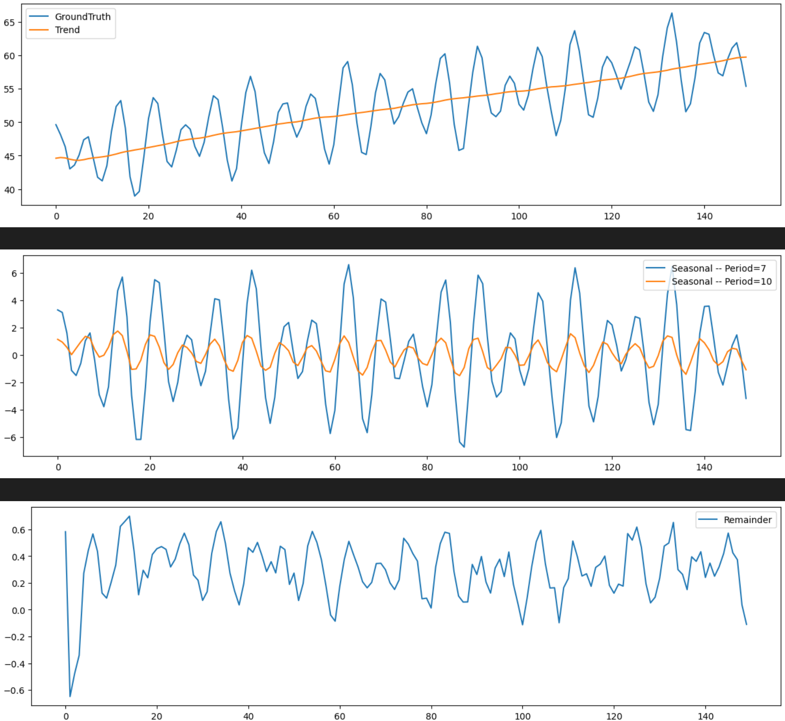

# OnlineSTL
An Unofficial implement of OnlineSTL: Scaling Time Series Decomposition by 100x

The link to the paper: https://www.vldb.org/pvldb/https://www.vldb.org/pvldb/vol15/p1417-mishra.pdf

If you find OnlineSTL useful, please cite the original paper.

```
@article{mishraonlinestl,
  title={OnlineSTL: Scaling Time Series Decomposition by 100x},
  author={Mishra, Abhinav and Sriharsha, Ram and Zhong, Sichen}
}
```

## The OnlineSTL Algorithm
<p align="center">

</p>

## Usage
1. Prepare your data
```python
# Your time series data, type(ts): numpy.ndarray
ts = YourData 

# Set the periods
period = [7, 10] 

# Divide the data into 2 parts: Part 1 for model initialization and Part 2 for online test.
ts_init = ts[:init_len]
ts_online = ts[init_len:]
```
2. Create an OnlineSTL model
```python
from OnlineSTL import OnlineSTL
model = OnlineSTL(ts_init, periods=periods)
```
3. Generate online decomposition results
```python
# x: Value of the new coming point
T, S, R = model.update(x)
```
We have also included a simple example in example.ipynb, which demonstrates a decomposition case on a synthetic time series using OnlineSTL.

## Results display
<p align="center">

</p>
